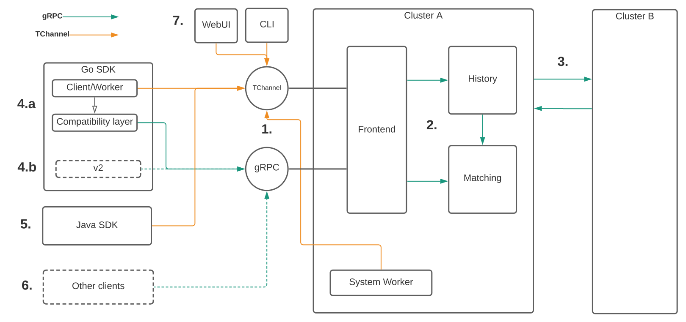

## Background
Cadence historically has been using TChannel transport with Thrift encoding for both internal RPC calls and communication with client SDKs. gRPC is becoming a de-facto industry standard with much better adoption and community support. It offers features such as authentication and streaming that are very relevant for Cadence. Moreover, TChannel is being deprecated within Uber itself, pushing an effort for this migration. During the last year we’ve implemented multiple changes in server and SDK that allows users to use gRPC in Cadence, as well as to upgrade their existing Cadence cluster in a backward compatible way. This post tracks the completed work items and our future plans.

## Our Approach
With ~500 services using Cadence at Uber and many more open source customers around the world, we had to think about the gRPC transition in a backwards compatible way. We couldn’t simply flip transport and encoding everywhere. Instead we needed to support both protocols as an intermediate step to ensure a smooth transition for our users.

Cadence was using Thrift/TChannel not just for the API with client SDKs. They were also used for RPC calls between internal Cadence server components and also between different data centers. When starting this migration we had a choice of either starting with public APIs first or all the internal things within the server. We chose the latter one, so that we could gain experience and iterate faster within the server without disruption to the clients. With server side done and listening for both protocols, dynamic config flag was exposed to switch traffic internally. It allowed gradual deployment and provided an option to rollback if needed.

<!-- truncate -->

The next step - client migration. We have more users for the Go SDK at Uber, that is why we started with it. Current version of SDK exposes Thrift types via public API, therefore we can not remove them without breaking changes. While we have plans for revamped v2 SDK, current users are able to use gRPC as well - with the help of a [translation adapter](https://github.com/cadence-workflow/cadence-go-client/blob/v0.18.2/compatibility/thrift2proto.go). Migration is underway starting with [cadence canary service](https://github.com/cadence-workflow/cadence/tree/master/canary), and then onboarding user services one by one.

We plan to support TChannel for a few more releases and then eventually drop it in a future.

## System overview

1. The frontend of [Cadence Server](https://github.com/cadence-workflow/cadence) exposes two inbounds for both gRPC and TChannel starting [v0.21.0 release](https://github.com/cadence-workflow/cadence/releases/tag/v0.21.0). gRPC traffic is being served on a different port that can be configured [here](https://github.com/cadence-workflow/cadence/blob/v0.21.0/config/development.yaml#L25). For gRPC API we introduced [proto IDL](https://github.com/cadence-workflow/cadence-idl/tree/master/proto/cadence-workflow/cadence/api/v1) definitions. We will keep TChannel open on frontend for some time to allow gradual client migration.
2. Starting with [v0.21.0](https://github.com/cadence-workflow/cadence/releases/tag/v0.21.0) internal components of Cadence Server (history & matching) also started accepting gRPC traffic. Sending traffic via gRPC is off by default and could be enabled with a flag in [dynamic config](https://github.com/cadence-workflow/cadence/blob/v0.21.0/config/dynamicconfig/development.yaml#L10). Planned for v0.24.0 it will be enabled by default, with an option to opt-out.
3. Starting with v0.23.0 communication between different Cadence clusters can be switched to gRPC via this [configuration](https://github.com/cadence-workflow/cadence/blob/0.23.x/config/development_active.yaml#L82). It is used for replication and request redirection to different DC.
4. [Go SDK](https://github.com/cadence-workflow/cadence-go-client) has exposed generated Thrift types via its public API. This complicated migration, because switching them to proto types (or rpc agnostic types) means breaking changes. Because of this we are pursuing two alternatives:
    1. (A) Short term: starting with [v0.18.2](https://github.com/cadence-workflow/cadence-go-client/releases/tag/v0.18.2) a [compatibility layer](https://github.com/cadence-workflow/cadence-go-client/blob/v0.18.2/compatibility/thrift2proto.go) is available which makes translation between thrift-proto types underneath. It allows using gRPC communication while still using Thrift based API. [Usage example](https://github.com/cadence-workflow/cadence-samples/pull/52).
    2. (B) Long term: we are currently designing v2 SDK that will support gRPC directly. Its API will be RPC agnostic and will include other usability improvements. You can check some ideas that are being considered [here](https://github.com/cadence-workflow/cadence-go-client/issues/1133).
5. [Java SDK](https://github.com/cadence-workflow/cadence-java-client) is currently on TChannel only. Move to gRPC is planned for 2022 H1.
6. It is now possible to communicate with gRPC from other languages as well. Use [proto IDLs](https://github.com/cadence-workflow/cadence-idl/tree/master/proto/cadence-workflow/cadence/api/v1) to generate bindings for your preferred language. [Minimal example](https://github.com/vytautas-karpavicius/cadence-python) for doing it in python.
7. WebUI and CLI are currently on TChannel. They are planned to be switched to gRPC for 2022 H1.

## Migration steps
### Upgrading Cadence server
In order to start using gRPC please upgrade Cadence server to **[v0.22.0](https://github.com/cadence-workflow/cadence/releases/tag/v0.22.0) or later**.
1. If you are using an older version (before v0.21.0), make sure to disable internal gRPC communication at first. Needed to ensure that all nodes in the cluster are ready to accept gRPC traffic, before switching it on. This is controlled by the [system.enableGRPCOutbound](https://github.com/cadence-workflow/cadence/blob/v0.21.0/config/dynamicconfig/development.yaml#L10) flag in dynamic config.
2. Once deployed, flip system.enableGRPCOutbound to true. It will require a cluster restart for setting to take effect.
3. If you are operating in more than one DC - recommended server version to upgrade to is v0.23.0 or newer. Once individual clusters with gRPC support are deployed, please update [config](https://github.com/cadence-workflow/cadence/blob/0.23.x/config/development_active.yaml#L82) to switch cross DC traffic to gRPC. Don’t forget to update ports as well. We also recommend increasing [grpcMaxMsgSize](https://github.com/cadence-workflow/cadence/blob/0.23.x/config/development.yaml#L29) to 32MB which is needed to ensure smooth replication. After config change you will need a restart for setting to take effect.
4. Do not forget that gRPC runs on a different port, therefore you might need to open it on docker containers, firewalls, etc.

### Upgrading clients
1. GoSDK - Follow an [example](https://github.com/cadence-workflow/cadence-samples/pull/52) to inject Thrift-to-proto adapter during client initialization and update your config to use the gRPC port.

### Status at Uber
* All clusters run gRPC traffic internally for 4 months without any issues.
* Cross DC traffic has been switched to gRPC this month.
* With internal tooling updated, we are starting to onboard services to use the Go SDK gRPC compatibility layer.

---
Do not hesitate to reach out to us ([cadence-oss@googlegroups.com](mailto:cadence-oss@googlegroups.com) or [slack](http://t.uber.com/cadence-slack)) if you have any questions.

The Uber Cadence team
