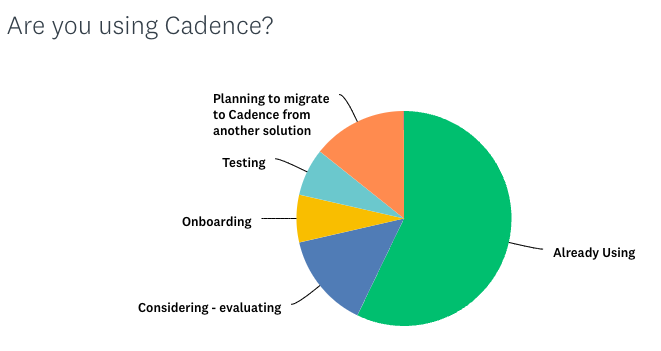
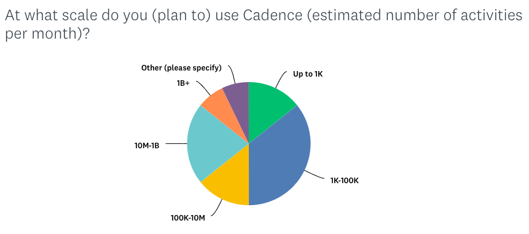
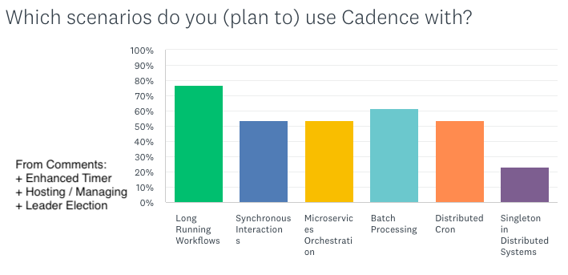

We released a user survey earlier this year to learn about who our users are, how they use Cadence, and how we can help them. It was shared from our [Slack workspace](https://uber-cadence.slack.com/), [cadenceworkflow.io](https://cadenceworkflow.io) Blog and [LinkedIn](https://www.linkedin.com/company/cadenceworkflow/). After collecting the feedback, we wanted to share the results with our community. Thank you everyone for filling it out! Your feedback is invaluable and it helps us shape our roadmap for the future.

Here are some highlights in text and you can check out the visuals to get more details:

Most of the people who replied to our survey were engineers who were already using Cadence, actively evaluating, or migrating from a similar technology. This was exciting to hear! Some of you have contacted us to learn more about benchmarks, scale, and ideal use cases. We will share more guidelines about this but until then, feel free to contact us over our Slack workspace for guidance.

<!-- truncate -->

The scale our users operating Cadence varies from thousands to billions of workflows per month. It was exciting to see it being used in both small and large scale companies.

Most survey responders were from Europe compared to any other place. This is in-line with the Cadence team growing its presence in Europe. Users from different places also contacted us to contribute to Cadence as a follow up to the survey. We will start putting up-for-grabs and new-starter tasks on Github. Several of them wanted to meet with a Zoom call and to discuss their use cases and best practices. As the Cadence team has presence in both the EU and the US, we welcome all our users to contact us anytime. Slack is the fastest way to reach us.

Cadence is followed in [Slack](https://uber-cadence.slack.com/) the most, then [Github](https://github.com/cadence-workflow/cadence) and [LinkedIn](https://www.linkedin.com/company/cadenceworkflow/). We are the most active in Slack and we plan to be more active in other mediums as well.

All of our main use cases were used across the board. While we mentioned the most common cases, several others were mentioned as a comment: enhanced timers, leader election etc.

We found out that Cadence has been used in several science communities. Some of them were using community built clients and were asking if we are going to support more languages. We are planning to take ownership of the Python and Javascript/Typescript clients and support them officially.

Documentation is by far what our users wanted improvements on. We are revamping our documentation soon and there will be major changes on our website soon.

Other requests were about observability, debuggability, operability, and usability. These areas have been our main focus this year and we are planning to release updates and blogs about them.

We noticed most of our users need help once a month or more. While we welcome questions and discussions over the mediums mentioned above, we plan to make more public posts about the common issues using our blog, StackOverflow, LinkedIn, or Twitter.

Many users wanted to hear more from Cadence about the roadmap and its growth. Our posts about these will be released soon. Expect more posts about upcoming features, investments, scale, and community updates. Follow us at [LinkedIn](https://www.linkedin.com/company/cadenceworkflow/) for such updates.

Our users are interested in learning more about guidelines, capacity expectations in on-prem and in managed solutions. While we have been providing feedback per user basis before, we plan to release more generic guidelines with our observability updates mentioned above.

We also would like to thank our community for the increased interest and engagement with us! Cadence has been more active in different mediums (LinkedIn, Slack, blog, etc.) this year. In the first quarter, we observed that our user base and activities has almost doubled (+96% and +90% respectively) through both new and returning users. Based on such immediate positive reactions, we will keep increasing our community investments in different channels.
