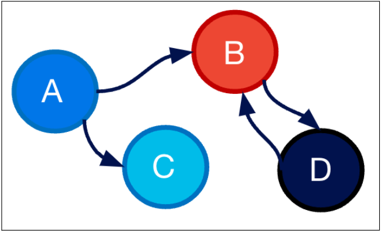

## Introduction

If you haven’t heard about Cadence, this section is for you. In a short description, Cadence is a code-driven workflow orchestration engine. The definition itself may not tell enough, so it would help splitting it into three parts:

* What’s a workflow? (everyone has a different definition)
* Why does it matter to be code-driven?
* Benefits of Cadence

### What is a Workflow?

In the simplest definition, it is “a multi-step execution”. Step here represents individual operations that are a little heavier than small in-process function calls. Although they are not limited to those: it could be a separate service call, processing a large dataset, map-reduce, thread sleep, scheduling next run, waiting for an external input, starting a sub workflow etc. It’s anything a user thinks as a single unit of logic in their code. Those steps often have dependencies among themselves. Some steps, including the very first step, might require external triggers (e.g. button click) or schedules. In the more broader meaning, any multi-step function or service is a workflow in principle.

<!-- truncate -->

While the above is a more correct way to define workflows, specialized workflows are more widely known: such as data pipelines, directed acyclic graphs, state machines, cron jobs, (micro)service orchestration, etc. This is why typically everyone has a different workflow meaning in mind. Specialized workflows also have simplified interfaces such as UI, configs or a DSL (domain specific language) to make it easy to express the workflow definition.

### Code-Driven Workflows

Over time, any workflow interface evolves to support more scenarios. For any non-code  (UI, config, DSL) technology, this means more APIs, concepts and tooling. However, eventually, the technology’s capabilities will be limited by its interface itself. Otherwise the interface will get more complicated to operate.

What happens here is users love the seamless way of creating workflow applications and try to fit more scenarios into it. Natural user tendency is to be able to write any program with such simplicity and confidence.

Given this natural evolution of workflow requirements, it’s better to have a code-driven workflow orchestration engine that can meet any future needs with its powerful expressiveness. On top of this, it is ideal if the interface is seamless, where engineers learn as little as possible and change almost nothing in their local code to write a distributed and durable workflow code. This would virtually remove any limitation and enable implementing any service as a workflow. This is what Cadence aims for.

### Benefits

With Cadence, many overheads that need to be built for any well-supported service come for free. Here are some highlights (see [cadenceworkflow.io](http://cadenceworkflow.io)):

* Disaster recovery is supported by default through data replication and failovers
* Strong multi tenancy support in Cadence clusters. Capacity and traffic management.
* Users can use Cadence APIs to start and interact with their workflows instead of writing new APIs for them
* They can schedule their workflows (distributed cron, scheduled start) or any step in their workflows
* They have tooling to get updates or cancel their workflows.
* Cadence comes with default metrics and logging support so users already get great insights about their workflows without implementing any observability tooling.
* Cadence has a web UI where users can list and filter their workflows, inspect workflow/activity inputs and outputs.
* They can scale their service just like true stateless services even though their workflows maintain a certain state.
* Behavior on failure modes can easily be configured with a few lines, providing high reliability.
* With Cadence testing capabilities, they can write unit tests or test against production data to prevent backward incompatibility issues.
* …

## Project Support

### Team

Today the Cadence team comprises 26 people. We have people working from Uber’s US offices (Seattle, San Francisco and Sunnyvale) as well as Europe offices (Aarhus-DK and Amsterdam-NL).

### Community

Cadence is an actively built open source project. We invest in both our internal and open source community ([Slack](http://t.uber.com/cadence-slack), [Github](https://github.com/cadence-workflow/cadence/issues)), responding to new features and enhancements.

### Scale

It’s one of the most popular platforms at Uber executing ~100K workflow updates per second. There are about 30 different Cadence clusters, several of which serve hundreds of domains. There are ~1000 domains (use cases) varying from tier 0 (most critical) to tier 5 scenarios.

### Managed Solutions

While Uber doesn’t officially sell a managed Cadence solution, there are companies (e.g. [Instaclustr](https://www.instaclustr.com/platform/managed-cadence/)) in our community that we work closely with selling Managed Cadence. Due to efficiency investments and other factors, it’s significantly cheaper than its competitors. It can be run in users’ on-prem machines or their cloud service of choice. Pricing is defined based on allocated hosts instead of number of requests so users can get more with the same resources by utilizing multi-tenant clusters.

## After V1 Release

Last year, around this time we announced [Cadence V1](https://www.uber.com/blog/announcing-cadence/) and shared our roadmap. In this section we will talk about updates since then. At a high level, you will notice that we continue investing in high reliability and efficiency while also developing new features.

### Frequent Releases

We announced plans to make more frequent releases last year and started making more frequent releases. Today we aim to release biweekly and sometimes release as frequently as weekly. About the format, we listened to our community and heard about having too frequent releases potentially being painful. Therefore, we decided to increment the patch version with releases while incrementing the minor version close to quarterly. This helped us ship much more robust releases and improved our reliability. Here are some highlights:

### Zonal Isolation

Cadence clusters have already been regionally isolated until this change. However, in the cloud, inter-zone communications matter as they are more expensive and their latencies are higher. Zones can individually have problems without impacting other cloud zones. In a regional architecture, a single zone problem might impact every request; however, with zonal isolation traffic from a zone with issues can easily be failed over to other zones, eliminating its impact on the whole cluster. Therefore, we implemented zonal isolation keeping domain traffic inside a single zone to help improve efficiency and reliability.

### Narrowing Blast Radius

When there are issues in a Cadence cluster, it’s often from a single misbehaving workflow. When this happens the whole domain or the cluster could have had issues until the specific workflow is addressed. With this change, we are able to contain the issue only to the offending workflow without impacting others. This is the narrowest blast radius possible.

### Async APIs

At Uber, there are many batch work streams that run a high number of workflows (thousands to millions) at the same time causing bottlenecks for Cadence clusters, causing noisy neighbor issues. This is because StartWorkflow and SignalWorkflow APIs are synchronous, which means when Cadence acks the user requests are successfully saved in their workflow history.

Even after successful initiations, users would then need to deal with high concurrency. This often means constant worker cache thrashing, followed by history rebuilds at every update, increasing workflow execution complexity to O(n^2) from O(n). Alternatively, they would need to quickly scale out and down their service hosts in a very short amount of time to avoid this.

When we took a step back and analyzed such scenarios, we realized that users simply wanted to “complete N workflows (jobs) in K time”. The guarantees around starts and signals were not really important for their use cases. Therefore, we implemented async versions of our sync API, by which we can control the consumption rate, guaranteeing the fastest execution with no disruption in the cluster.

Later this year, we plan to expand this feature to cron workflows and timers as well.

### Pinot as Visibility Store

[Apache Pinot](https://pinot.apache.org/) is becoming popular due to its cost efficient nature. Several teams reported significant savings by changing their observability storage to Pinot. Cadence now has a Pinot plugin for its visibility store. We are still rolling out this change. Latencies and cost savings will be shared later.

### Code Coverage

We have received many requests from our community to actively contribute to our codebase, especially after our V1 release. While we have been already collaborating with some companies, this is a challenge with individuals who are just learning about Cadence. One of the main reasons was to avoid bugs that can be introduced.

While Cadence has many integration tests, its unit test coverage was lower than desired. With better unit test coverage we can catch changes that break previous logic and prevent them getting into the main branch. Our team covered additional 50K+ lines in various Cadence repos. We hope to bring our code coverage to 85%+ by the end of year so we can welcome such inquiries a lot easier.

### Replayer Improvements

This is still an ongoing project. As mentioned in our V1 release, we are revisiting some core parts of Cadence where less-than-ideal architectural decisions were made in the past. Replayer/shadower is one of such parts. We have been working on improving its precision, eliminating false negatives and positives.

### Global Rate Limiters

Cadence rate limiters are equally distributed across zones and hosts. However, when the user's traffic is skewed, rate limits can get activated even though the user has more capacity. To avoid this, we built global rate limiters. This will make rate limits much more predictable and capacity management a lot easier.

### Regular Failover Drills

Cadence has been performing monthly regional and zonal failover drills to ensure its failover operations are working properly in case we need it. We are failing over hundreds of domains at the same time to validate the scale of this operation, capacity elasticity and correctness of workflows.

### Cadence Web v4

We are migrating Cadence web from Vue.js to React.js to use a more modern infrastructure and to have better feature velocity. We are about 70% complete with this migration and hope to release the new version of it soon.

### Code Review Time Non-determinism Checks

(This is an internal-only feature that we hope to release soon) Cadence non-determinism errors and versioning were common pain points for our customers. There are available tools but they require ongoing effort to validate. We have built a tool that generates a shadower test with a single line command (one time only operation) and continuously validates any code change against production data.

This feature reduced the detect-and-fix time from days/weeks to minutes. Just by launching this feature to the domains with the most non-determinism errors, the number of related incidents reduced by 40%. We have already blocked 500+ diffs that would potentially impact production negatively. This boosted our users’ confidence in using Cadence.

### Domain Reports

(This is an internal-only feature that we hope to release soon) We are able to detect potential issues (bugs, antipatterns, inefficiencies, failures) with domains upon manual investigation. We have automated this process and now generate reports for each domain. This information can be accessed historically (to see the progression over time) and on-demand (to see the current state). This has already driven domain reliability and efficiency improvements.

This feature and above are at MVP level where we plan to generalize, expand and release for open source soon. In the V1 release, we have mentioned that we would build certain features internally first to be able to have enough velocity, to see where they are going and to make breaking changes until it’s mature.

### Client Based Migrations

With 30 clusters and ~1000 domains in production, migrating a domain from a cluster to another became a somewhat frequent operation for Cadence. While this feature is mostly automated, we would like to fully automate it to a level that this would be a single click or command operation. Client based migrations (as opposed to server based ones) give us big flexibility that we can have migrations from many to many environments at the same time. Each migration happens in isolation without impacting any other domain or the cluster.

This is an ongoing project where remaining parts are migrating long running workflows faster and seamless technology to technology migrations even if the “from-technology” is not Cadence in the first place. There are many users that migrated from Cadence-like or different technologies to Cadence so we hope to remove the repeating overhead for such users.

## Roadmap (Next Year)

Our priorities for next year look similar with reliability, efficiency, and new features as our focus. We have seen significant improvements especially in our users’ reliability and efficiency on top of the improvements in our servers. This both reduces operational load on our users and makes Cadence one step closer to being a standard way to build services. Here is a short list of what's coming over the next 12 months:

### Database efficiency

We are increasing our investment in improving Cadence’s database usage. Even though Cadence’s cost looks a lot better compared to the same family of technologies, it can still be significantly improved by eliminating certain bottlenecks coming from its original design.

### Helm Charts

We are grateful to the Cadence community for introducing and maintaining our Helm charts for operating Cadence clusters. We are taking its ownership so it can be officially released and tested. We expect to release this in 2024.

### Dashboard Templates

During our tech talks, demos and user talks, we have received inquiries about what metrics care about. We plan to release templates for our dashboards so our community would look at a similar picture.

### Client V2 Modernization

As we announced last year that we plan to make breaking changes to significantly improve our interfaces, we are working on modernizing our client interface.

### Higher Parallelization and Prioritization in Task Processing

In an effort to have better domain prioritization in multitenant Cadence clusters, we are improving our task processing with higher parallelization and better prioritization. This is a lot better model than just having domains with defined limits. We expect to provide more resources to high priority domains during their peak hours while allowing low priority domains to consume much bigger resources than allocated during quiet times.

### Timer and Cron Burst Handling

After addressing start and signal burst scenarios, we are continuing with bursty timers and cron jobs. Many users set their schedules and timers for the same second with the intention of being able to finish N jobs within a certain amount of time. Current scheduling design isn’t friendly for such intents and high loads can cause temporary starvation in the cluster. By introducing better batch scheduling support, clusters can continue with no disruption while timers are processed in the most efficient way.

### High zonal skew handling

For users operating in their own cloud and having multiple independent zones in every region, zonal skews can be a problem and can create unnecessary bottlenecks when Zonal Isolation feature is enabled. We are working on addressing such issues to improve task matching across zones when skew is detected.

### Tasklist Improvements

When a user scenario grows, there are many knobs that need to be manually adjusted. We would like to automatically partition and smartly forward tasks to improve tasklist efficiency significantly to avoid backlogs, timeouts and hot shards.

### Shard Movement/Assignment Improvements

Cadence shard movements are based on consistent hash and this can be a limiting factor for many different reasons. Certain hosts can end up getting unlucky by having many shards, or having heavy shards. During deployments we might observe a much higher number of shard movements than desired, which reduces the availability. With improved shard movements and assignments we can have more homogenous load among hosts while also having a minimum amount of shard movements during deployments with much better availability.

### Worker Heartbeats

Today, there’s no worker liveliness tracking in Cadence. Instead, task or activity heartbeat timeouts are used to reassign tasks to different workers. For latency sensitive users this can become a big disruption. For long activities without heartbeats, this can cause big delays. This feature is to eliminate depending on manual timeout or heartbeat configs to reassign tasks by tracking if workers are still healthy. This feature will also enable so many other new efficiency and reliability features we would like to get to in the future.

### Domain and Workflow Diagnostics

Probably the two most common user questions are “What’s wrong with my domain?” and “What’s wrong with my workflow?”. Today, diagnosing what happened and what could be wrong isn’t that easy apart from some basic cases. We are working on tools that would run diagnostics on workflows and domains to point out things that might potentially be wrong with public runbook links attached. This feature will not only help diagnose what is wrong with our workflows and domains but will also help fix them.

### Self Serve Operations

Certain Cadence operations are performed through admin CLI operations. However, these should be able to be done via Cadence UI by users. Admins shouldn’t need to be involved in every step or the checks they validate should be able to be automated. This is what the initiative is about including domain registration, auth/authz onboarding or adding new search attributes but it’s not limited to these operations.

### Cost Estimation

One big question we receive when users are onboarding to Cadence is “How much will this cost me?”. This is not an easy question to answer since data and traffic load can be quite different. We plan to automate this process to help users understand how much resources they will need. Especially in multi-tenant clusters, this will help users understand how much room they still have in their clusters and how much the new scenario will consume.

### Domain Reports (continue)

We plan to release this internal feature to open source as soon as possible. On top of presenting this data on built-in Cadence surfaces (web, CLI. etc.) we will create APIs to make it integratable with deployment systems, user service UIs, periodic reports and any other service that would like to consume.

### Non-determinism Detection Improvements (continue)

We have seen great reliability improvements and reduction in incidents with this feature on the user side last year. We continue to invest in this feature and make it available in open source as soon as possible.

### Domain Migrations (continue)

In the next year, we plan to finish our seamless client based migration to be able to safely migrate domains from one cluster to another, one technology (even if it’s not Cadence) to another and one cloud solution to another. There are only a few features left to achieve this.

## Community

Do you want to hear more about Cadence? Do you need help with your set-up or usage? Are you evaluating your options? Do you want to contribute? Feel free to join our community and reach out to us.

Slack: [https://uber-cadence.slack.com/](https://uber-cadence.slack.com/)

Github: [https://github.com/cadence-workflow/cadence](https://github.com/cadence-workflow/cadence)

Since last year, we have been contacted by various companies to take on bigger projects on the Cadence project. As we have been investing in code coverage and refactoring Cadence for a cleaner codebase, this will be a lot easier now. Let us know if you have project ideas to contribute or if you’d like to pick something we already planned.

Our monthly community meetings are still ongoing, too. That is the best place to get heard and be involved in our decision-making process. Let us know so we can send you an invite. We are also working on a broader governing model to open up this project to more people. Stay tuned for updates on this topic!
