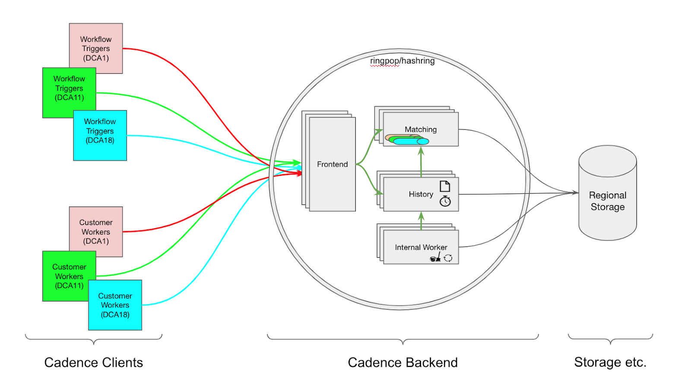

At Uber, we want to achieve regional resilience such that losing a zone within a region can be tolerated without requiring a cross-region failover. We also want to make sure that losing a zone only affects a subset of workload, at most, rather than everything. However, in Cadence-based systems, the workload in a region is distributed randomly across all workers in the region at a “task-level granularity”, which means a workflow may be worked on by any worker in the region where the domain is active. To achieve this goal, we introduced Zonal Isolation for Cadence Workflows - a feature designed to pin workflows to the zone they are started in, so that zonal isolation can be achieved at a workflow-level.

## What is Zonal Isolation for Cadence Workflows?
At high-level, Zonal Isolation for Cadence Workflows can be thought in 2 levels:

1. **Task-level isolation:** All decision tasks and activity tasks of a workflow are only processed by workers from the zone where the workflow was started
2. **Infrastructure-level isolation:** Within a regional Cadence cluster, workflows are handled by server instances in the same zone where they were started, and the corresponding data is stored in that zone as well.

Infrastructure-level isolation is quite challenging to implement as it requires significant changes to the core design of the Cadence server. Due to the complexity involved, support for this feature is not planned for the foreseeable future.

As a result, the focus remains on achieving task-level zonal isolation outside the Cadence server, which offers a more practical and immediate way to improve system resilience. It provides the capability of ensuring that an unhealthy zone (i.e. bad deployment of workers) only affect a subset of workflows (started from a certain zone) rather than every workflow in a Cadence domain.

<!-- truncate -->

## How Zonal Isolation Works in Cadence?

### Architecture
Here is what the architecture of a zonally isolated Cadence-based system looks like:

*<p>Fig: Workflows started in one zone are only dispatched to workers from the same zone. Colors to emphasize pinning.</p>*
### Implementation

#### Determine the zone of a workflow and workers

To ensure that tasks are dispatched to workers in the same zone as the workflows, we must identify the origin zone of both. The zone of a workflow is determined by the origin zone of the StartWorkflowExecution request, while the zone of workers is determined by the origin zone of the PollForDecisionTask and PollForActivityTask requests. There are three possible ways to determine the origin zone for these requests:

- **Uber's Approach:** Let Cadence SDK set the origin zone in the headers of the requests before sending the request to Cadence.
- **Preferred Approach:** Get the origin zone of the requests from headers set by network infrastructure.
- Determine the origin zone of the requests from the zone of the cadence-frontend instance receiving the request, if the network layer has already achieved zonal isolation.

The 2nd approach is the ideal one, but Uber's network infrastructure doesn't provide such headers and the network layer is not ready for zonal isolation. As a result, we adopt the 1st approach. At Uber, we have internal libraries in Go and Java acting as wrappers around Cadence SDK injecting necessary configurations. These libraries have been updated to include the origin zone in the request headers using a header called `cadence-client-isolation-group`.

#### How to dispatch tasks to workers from the same zone?
To implement task-level isolation, we introduce a new dimension to the tasklist — **isolation group**. When a workflow is initiated, the origin zone of the workflow is stored in the database. Each time a decision or activity task is dispatched to cadence-matching, the workflow's origin zone is used as the isolation group for that task.

When a worker sends a `PollForDecisionTask` or `PollForActivityTask` request to cadence-matching, the request is labeled with the worker's isolation group (i.e., the worker's zone). Tasks are then dispatched only to poller requests that have the same isolation group, ensuring that tasks are processed by workers in the same zone as the workflow's origin.
#### How to handle workflows from a drained zone?
In the event of an outage, such as a bad deployment, customers may want to drain workers from a specific zone to mitigate the impact. There are two types of drains that can occur:
1. **Implicit drain:** Workers from a zone completely stop operating, either due to failures or manual shutdowns.
2. **Explicit drain:** Customers explicitly mark workers from a zone as drained.

Within cadence-matching, a list of pollers is maintained for each tasklist, tracking the zone from which the pollers originate. An implicit drain can be detected by checking whether there are any active pollers from a particular zone. If a zone is drained (either explicitly or implicitly), workflows that were started in that zone will be reassigned and spread to workers in the remaining healthy zones.
##### How to drain a zone explicitly?
Explicitly draining a zone can be done at two levels:
1. **Domain-level drain:** This applies to a specific domain, allowing the zone to be drained only for workflows within that domain.
2. **Cluster-level drain:** This applies to the entire Cadence cluster, draining the zone for all domains and workflows within the cluster.

For domain-level drain, the draining status is stored in [`domains`](https://github.com/cadence-workflow/cadence/blob/v1.2.13/schema/cassandra/cadence/schema.cql#L412) table. For cluster-level drain, the status is stored in [`cluster_config`](https://github.com/cadence-workflow/cadence/blob/v1.2.13/schema/cassandra/cadence/schema.cql#L498) table.

## How to enable Zonal Isolation?
### Server Update
In order to enable this feature, please upgrade Cadence server to [v1.2.1](https://github.com/cadence-workflow/cadence/releases/tag/v1.2.1) or later.

**NOTE:** If you're not using the provided main binary located in `cmd/server`, you must adopt this [middleware](https://github.com/cadence-workflow/cadence/blob/v1.2.1/common/rpc/middleware.go#L188). Depends on the appoach to [determine the origin zone of requests](#determine-the-zone-of-a-workflow-and-workers), you can adopt this [middleware](https://github.com/cadence-workflow/cadence/blob/v1.2.1/common/rpc/middleware.go#L229) or build your own middleware using [`partition.ContextWithConfig`](https://github.com/cadence-workflow/cadence/blob/v1.2.1/common/partition/context.go#L42) function to inject origin zone into the context.

This feature is controlled by 2 dynamic config properties.
- `system.allIsolationGroups`: This property provides the list of available zones within a region.
- `system.enableTasklistIsolation`: This property enables Zonal Isolation at domain level.
It’s important to note that any update to the `system.allIsolationGroups` property requires a restart of the cadence-matching service for the changes to take effect. This ensures that the new zone configuration is properly loaded and applied. However, the `system.enableTasklistIsolation` property can be updated dynamically without requiring a restart, making it more flexible for enabling or disabling Zonal Isolation on a per-domain basis.

An example configuration using the file based dynamic configuration could look like this:
```yaml
system.allIsolationGroups:
- value: []
  constraints: {}
- value: ["dca1", "dca2", "dca3"]
  constraints:
    clusterName: prod-dca
- value: ["phx1", "phx2", "phx3"]
  constraints:
    clusterName: prod-phx
system.enableTasklistIsolation:
- value: false
  constraints: {}
- value: true
  constraints:
    domainName: samples-domain
```
In this example, the Cadence cluster spans two regions, each containing three zones: `dca1`, `dca2`, `dca3` in the `dca` region and `phx1`, `phx2`, `phx3` in the `phx` region. Zonal isolation is enabled only for the `samples-domain`, while it remains disabled for other domains.

### SDK Update
NOTE: This update is only necessary if you're using the 1st approach to [determine the origin zone of requests](#determine-the-zone-of-a-workflow-and-workers).

To support Zonal Isolation, please upgrade your SDK versions:
- **Go SDK:** Upgrade to [v1.0.2](https://github.com/cadence-workflow/cadence-go-client/releases/tag/v1.0.2) or later.
- **Java SDK:** Upgrade to [v3.9.0](https://github.com/cadence-workflow/cadence-java-client/releases/tag/v3.9.0) or later.

**For Java SDK users**, set the [`isolationGroup`](https://github.com/cadence-workflow/cadence-java-client/blob/v3.9.0/src/main/java/com/uber/cadence/serviceclient/ClientOptions.java#L83) field to the zone of the instance when creating `serviceClient`.

**For Go SDK users**, set the [`isolationGroup`](https://github.com/cadence-workflow/cadence-go-client/blob/v1.0.2/internal/worker.go#L132) field to the zone of the instance when creating `Worker`. Additionally, you need to use [this method](https://github.com/cadence-workflow/cadence-go-client/blob/v1.0.2/isolationgroup/wrapper.go#L29C39-L29C70) to wrap `workflowserviceclient.Interface`.
## How to drain a zone explicitly?
Drains can be done via the [Admin APIs](https://github.com/cadence-workflow/cadence-idl/blob/50a4ee241e50c6baab8e5d47540b176c5ee022a4/proto/cadence-workflow/cadence/admin/v1/service.proto#L125) of cadence-frontend or CLI.

You can check the help message for the CLI by running:
```bash
cadence admin isolation-groups -h
```
## Monitoring
A new metric is introduced to help detect the leakage of tasks and skewness of traffic.

`isolation_task_matches_per_tl`: This is a counter that counts the number of tasks polled by workers. The metric is tagged with the domain, tasklist name, tasklist type, the origin zone of the workflow and the origin zone of the worker polling the task.

This metric can be used in the following ways:

**Detecting task leakage:** By grouping tasks based on the origin zones of both the workflows and workers, you can identify tasks that have leaked, i.e., tasks assigned to workers in zones different from the workflow's origin zone.

**Identifying traffic skewness:** By grouping tasks based solely on the origin zones of workflows, you can determine if traffic is disproportionately distributed among the zones, helping to detect any uneven load or traffic imbalance across zones.

## Status at Uber
- We launched this feature at Uber in July 2023. More than 100 domains have Zonal Isolation enabled.
- However, as of 2024, the rollout of Zonal Isolation is paused due to a traffic skewness issue:
  - Some customers have highly skewed traffic that some zones have more workflows than other zones, but the number of workers are evenly distributed in all zones. Enabling Zonal Isolation for the customers will decrease the utilization of their workers and may cause high latency for the customers.

## Next Step
Currently, Zonal Isolation is implemented as **hard isolation**, where tasks are strictly limited to the same zone as the originating workflow. To address the traffic skewness issue, we are working on iterating this feature to introduce **soft isolation**. This relaxed version will allow for some task leakage between zones if traffic skewness is detected, ensuring better worker utilization and reducing latency.

This enhancement is one of our major ongoing projects, and we plan to share more details in a future blog post once it is launched.
